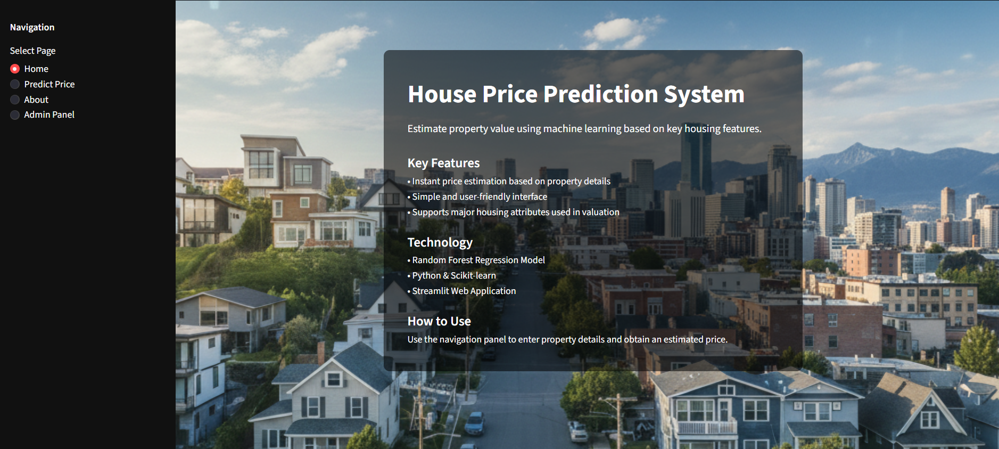
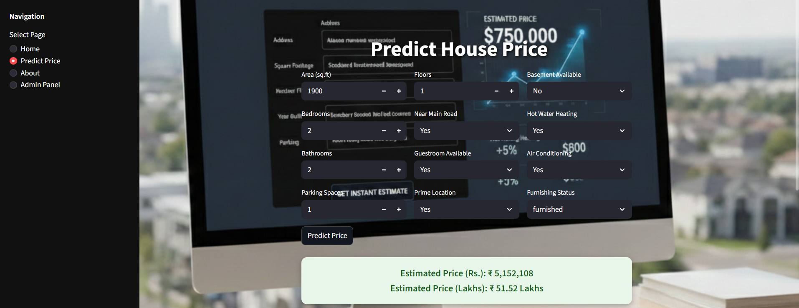

# house-price-prediction-ml
Machine Learning project that predicts house prices based on property features using a Random Forest regression model with data preprocessing and model evaluation.

## 📷 App Preview

  

  

---

## 📌 Project Overview

This project uses a Random Forest Regressor model to predict house prices based on various input features such as:

- Area
- Bedrooms
- Bathrooms
- Location
- etc.

The model is trained on historical housing data and deployed using Streamlit for an interactive web interface.

---

## 🚀 Technologies Used

- Python
- Pandas
- NumPy
- Scikit-learn
- Matplotlib
- Streamlit
- Joblib

---

## 📊 Model Details

- Algorithm: Random Forest Regressor
- Evaluation Metric: R² Score / MAE
- Feature Importance Visualization included

---

## 🖥️ How To Run The Project

1. Clone the repository:

bash
git clone https://github.com/sanky48/house-price-prediction-ml.git

2.Install dependencies:

pip install -r requirements.txt

3. Run the Streamlit app:
bash
streamlit run app.py

## Author
Sanket Ainapure.
